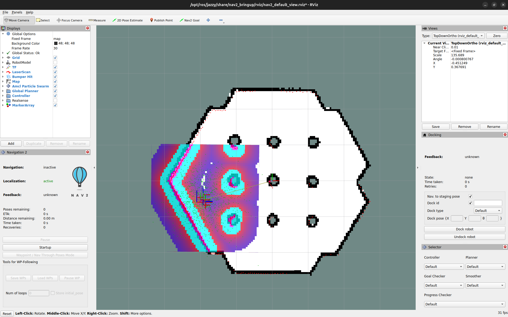

# Mowing Robot Behavior Tree (mowing_robot_bt)

This repository provides a ROS2-based task planner for an autonomous mowing robot using behavior trees.

## Setup Instructions

### 1. Clone this Repository

First, clone this repository into your ROS2 workspace

### 2. Clone and Setup Dependency Repository

Clone the required dependency repository:

```bash
git clone https://github.com/TrescherDe/PMBW_Object_Detection_In_Thermal_Images
```

Follow the setup instructions provided in the dependency repository.

### 3. Clone and Setup the Optris Repository

Clone the required dependency repository:

```bash
git clone https://github.com/evocortex/optris_drivers2/tree/master
```

Follow the setup instructions provided in the dependency repository.

### 4. Source the Virtual Environment

Activate the virtual environment created during the dependency setup:

```bash
source <path-to-venv>/bin/activate
```

### 4. Build the Workspace

Navigate to your ROS2 workspace and build the packages:

```bash
cd ~/ros_ws
colcon build
```

### 5. Install nav2

Follow the official Nav2 installation guide: [Getting Started with Nav2](https://docs.nav2.org/getting_started/index.html)

### 6. Start the Simulation Based on Nav2

Launch the simulation:

```bash
ros2 launch mowing_robot_bt tb3_simulation_launch.py
```


Perform a 2D Pose Estimation, and you should see the laserscan data and the costmap:



Next, follow these steps:
1. Click on **"Startup"**.
2. Select **"Waypoint / Nav Through Poses Mode"**.
3. Click on **"Load WPs"** to load waypoints.

You should see the following screen:


Finally, click on **"Start Nav Through Poses"** to begin navigation.

### 7. Run the Task Planner

Run the task planner node for the mowing robot:

```bash
ros2 run mowing_robot_bt task_planner
```

### 8. Start Your Camera or Send Dummy Messages
   
- **Option 1:** Start your camera using the appropriate command:

```bash
ros2 run optris_drivers2 optris_imager_node
```

- **Option 2:** Send dummy thermal image messages to simulate the camera feed:

```bash
ros2 topic pub /thermal_image sensor_msgs/Image -r 0.1
```

### 9. Object Detection and Path Replanning

If an object is detected, a point will be published in the simulation, and the planner will replan around it.

The detected point is published and displayed on the map:


The replanned path is shown as follows:


## Notes
- Ensure all dependencies are installed correctly.
- The task planner relies on camera input; you can simulate it with dummy messages if necessary.
- Adjust paths and URLs according to your setup.
